# 软件需求规格说明书（SRS）

| 版本 | 日期      | 描述                           | 作者   |
| ---- | --------- | ------------------------------ | ------ |
| V1.0 | 2019.4.10 | 领域建模                       | 宋晓彤 |
| V1.1 | 2019.4.15 | 状态建模                       | 宋晓彤 |
| V1.2 | 2019.5.1  | 用例建模                       | 宋晓彤 |
| V1.3 | 2019.5.7  | 用例建模（问卷活动图）         | 宋晓彤 |
| V1.4 | 2019.5.15 | 补充需求                       | 宋晓彤 |
| V2.0 | 2019.5.20 | 用例建模（个人登录、首页）     | 宋晓彤 |
| V3.0 | 2019.5.27 | 用例建模（跑腿）、补充需求     | 宋晓彤 |
| V3.1 | 2019.6.1  | 领域建模（修改新版本状态）     | 宋晓彤 |
| V3.2 | 2019.6.9  | 补充需求                       | 宋晓彤 |
| V4.0 | 2019.6.15 | 用例建模（历史信息）、领域建模 | 宋晓彤 |
| V4.1 | 2019.6.24 | 补充需求                       | 宋晓彤 |

### 目录

1. [用例建模](#1)
   - 1.1 [用例图](#1.1)
   - 1.2 [多泳道活动图](#1.2)
2. [业务流程描述](#2)
   - 2.1 [基本用例](#2.1)
   - 2.2 [扩展用例](#2.2)
3. [领域建模](#3)
   - 3.1 [全系统领域模型](#3.1)
   - 3.2 [子系统领域模型](#3.2)
4. [状态建模](#4)
   - 4.1 [问卷对象状态模型](#4.1)
   - 4,2 [跑腿对象状态模型](#4.2)
5. [功能建模](#5)
   - 5.1 [问卷功能](#5.1)
   - 5.2 [跑腿功能](#5.2)
   - 5.3 [账户管理](#5.3)
   - 5.4 [通知相关](#5.4)
   - 5.5 [个人中心](#5.5)
6. [补充需求](#6)

<h2 id="1">一、用例建模</h2>

<h3 id="1.1">1. 用例图</h3>

<h4 id="1.1.01">1.1 系统用例总览</h4>

下图为Time is Money挣闲钱平台系统用例图一览，其中，子用例图及其活动图见[业务流程描述](#2)

Time is money的用例主要包括注册/登录、首页操作、发布任务、接受任务、收藏任务，以及通知操作，其中不同的用例所关联的用例也不相同，下图对此做出了总体的说明。

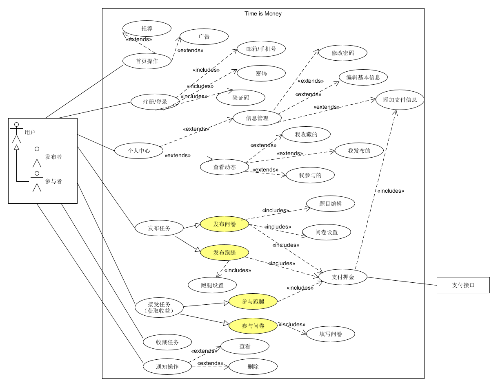

<h3 id="1.2">2. 活动图</h3>

对于Time is Money平台来说，最主要的业务逻辑在于任务的交易过程，任务又被分为跑腿与问卷，由此，我们分别对这两项业务进行泳道图绘制(以下业务流程均为happy path)

<h4 id="1.2.01">2.1 问卷交易业务</h4>

发布者编辑问卷题目->发布者设置问卷信息->发布者提交押金->接受者接受任务->接受者填写问卷->发布者关闭问卷->交易结算

<h4 id="1.2.02">2.2 跑腿交易业务</h4>

发布者设置跑腿信息->发布者提交押金->接受者提交押金->接受者完成任务->发布者确认跑腿完成->交易结算

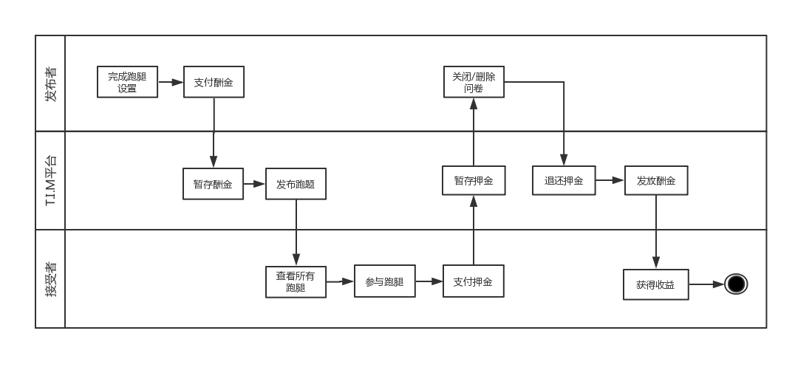

<h2 id="2">二、业务流程描述</h2>

Time is Money平台在总体上可以分为6个结构：注册/登录、首页、问卷、跑腿、通知、个人中心，而对于用例设计来说，主要分为信息管理、任务发布、任务接受、收益结算四个部分，对此，我们进行了子用例图的绘制（用例图与活动图请点击链接查看）。

<h3 id="2.1">1. 基本用例</h3>

#### 1.1 信息管理

#####  **A.注册**

###### 用例说明

（1）用户使用邮箱/手机号、密码以及验证码进行注册

（2）同一邮箱/手机号不可重复注册

（3）邮箱与手机号必须有效

（4）验证码需与图片一致

###### 用例图

###### 活动图

##### **B. 登录**

###### 用例说明

（1）用户使用邮箱/手机号、密码以及验证码进行登录

（2）邮箱与手机号必须有效

（3）密码必须正确

（4）验证码需与图片一致

###### 用例图

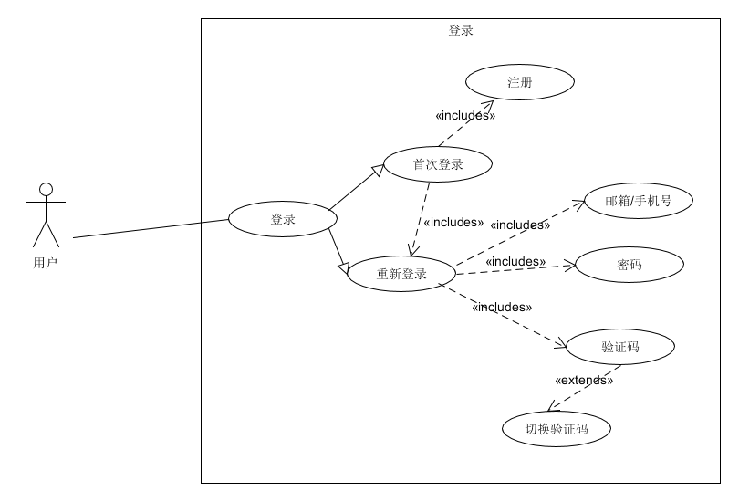

###### 活动图

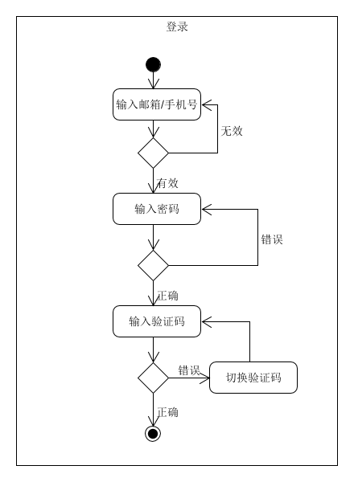

#### 1.2 任务发布

##### A. 发布问卷

###### 用例说明

（1）用户需要登录才能发布问卷

（2）允许用户编辑问卷内容，问卷内容目前支持选择题和填空题

（3）题目允许修改标题、修改顺序、增加、删除、必答，选择题允许设置多选数量

（4）用户需要设置问卷参数才能发布问卷

（5）用户需要支付问卷数*问卷酬金的虚拟币才能发布问卷

###### 用例图

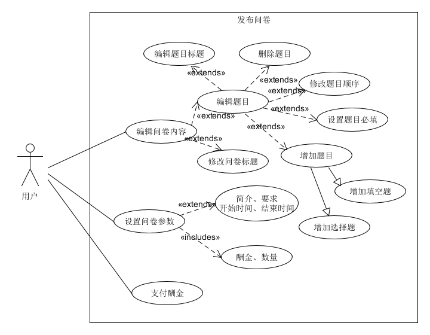

###### 活动图

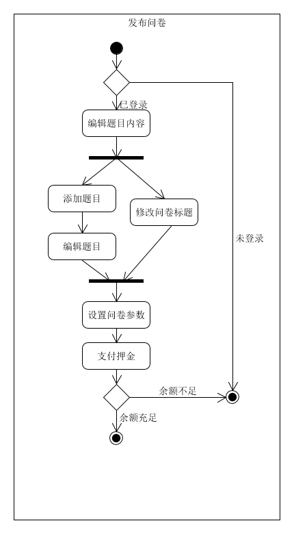

##### B.发布跑腿

###### 用例说明

（1）用户需要登录才能发布跑腿

（2）用户需要设置跑腿参数才能发布问卷

（3）用户需要支付跑腿酬金的虚拟币才能发布跑腿

###### 用例图

###### 活动图

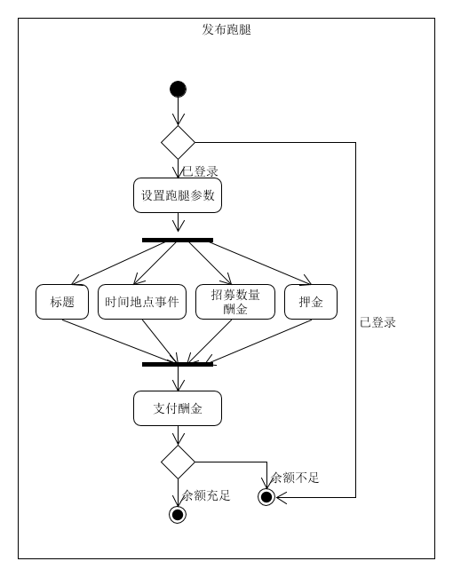

#### 1.3 任务接受

##### A. 填写问卷

###### 用例说明

（1）用户需要登录才能填写问卷

（2）用户需要根据发布者的题目要求填写题目

（3）用户填写问卷并成功提交之后可以获得收益

###### 用例图

###### 活动图

##### B. 参与跑腿

###### 用例说明

（1）用户需要登录才能参与跑腿

（2）用户需要根据发布者的要求提交押金

（3）用户参与跑腿并得到发布者确认完成之后可以获得收益

###### 用例图

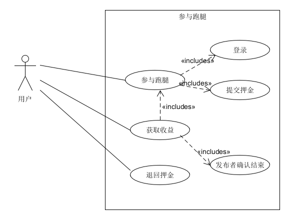

###### 活动图

<h3 id="2.2">2. 扩展用例</h3>

#### 2.1 信息管理

##### A. 验证码

###### 用例说明

（1）用户登录时需要使用验证码进行人机验证

（2）用户注册时需要使用验证码进行人机验证以及手机/邮箱验证

###### 用例图

###### 活动图

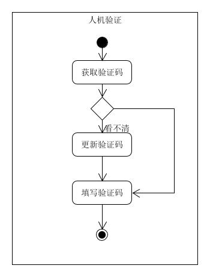

##### B. 修改密码

###### 用例说明

（1）用户修改密码时需要输入原始密码

###### 用例图

###### 活动图

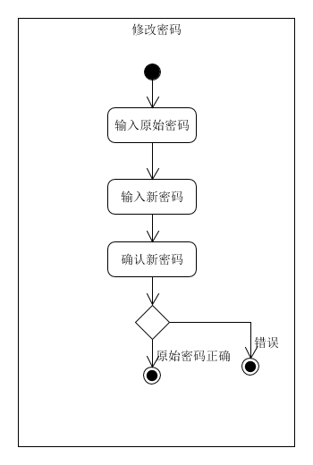

#### 2.2 任务发布/接受

##### A. 支付押金

###### 用例说明

（1）用户在发布问卷、发布跑腿、参与跑腿时需要支付押金

（2）发布问卷：押金=招募问卷数*问卷酬金

（3）发布跑腿：押金=招募跑腿人数*跑腿酬金

（4）参与跑腿：押金=用户设定押金

###### 用例图

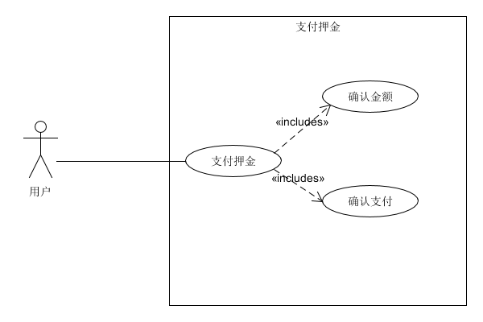

###### 活动图

##### B. 编辑问卷题目内容

###### 用例说明

（1）用户在发布问卷时可以修改问卷标题、编辑题目内容，如增加题目、删除题目、编辑题目

（2）选择题：标题、题目顺序、选项数量、选项内容、最多选择数、必选

（3）填空题：标题、题目顺序、必填

（3）发布跑腿：押金=招募跑腿人数*跑腿酬金

（4）参与跑腿：押金=用户设定押金

###### 用例图

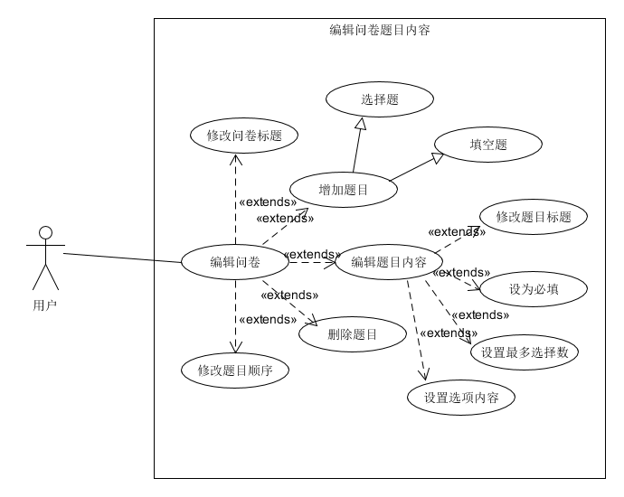

###### 活动图

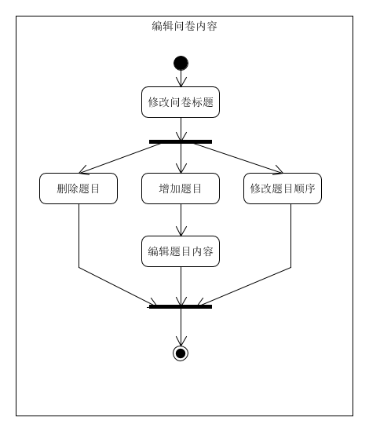

##### C. 关闭任务

###### 用例说明

（1）用户可以关闭自己发布的问卷、跑腿任务

（2）关闭问卷：用户可以在任何时刻关闭问卷，未发放的酬金会退回到用户账户

（3）关闭跑腿：用户尽可在没有人参与跑腿/跑腿已经完成时关闭跑腿，未发放的酬金会退回到用户账户

###### 用例图

###### 活动图

##### D. 查看参与情况

###### 用例说明

（1）用户可以查看自己发布任务的参与情况

（2）除了问卷参与列表外用户也可查看获取到的问卷答案

###### 用例图

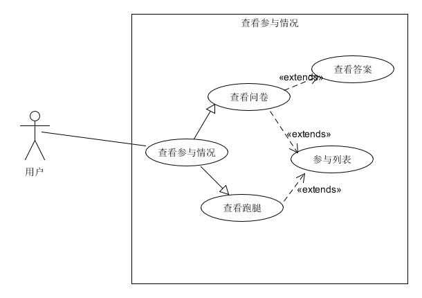

###### 活动图

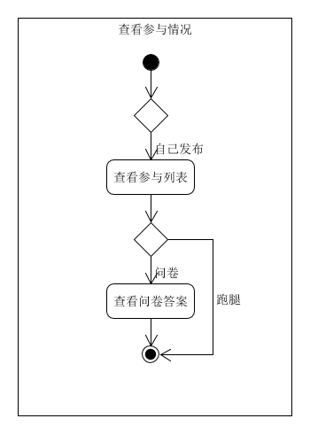

#### 2.3 收益相关

##### A. 虚拟币

###### 用例说明

（1）用户只有在绑定支付账户时才可以使用虚拟币功能

（2）虚拟币支持充值与提现两种操作

###### 用例图

###### 活动图

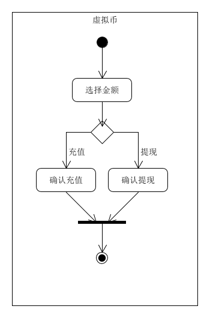

#### 2.4 其他

##### A. 通知系统

###### 用例说明

（1）用户可以接收通知、发送通知、删除通知、标为已读/未读

###### 用例图

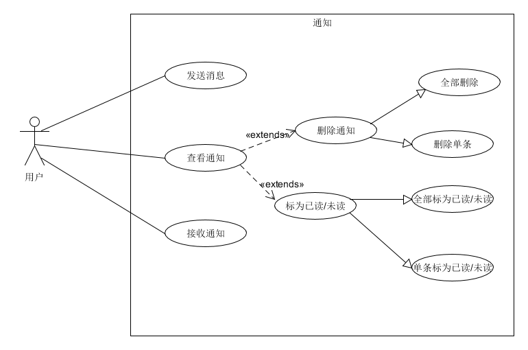

###### 活动图

<h2 id="3">三、领域建模</h2>

<h3 id="3.1">1. 全系统领域建模</h2>

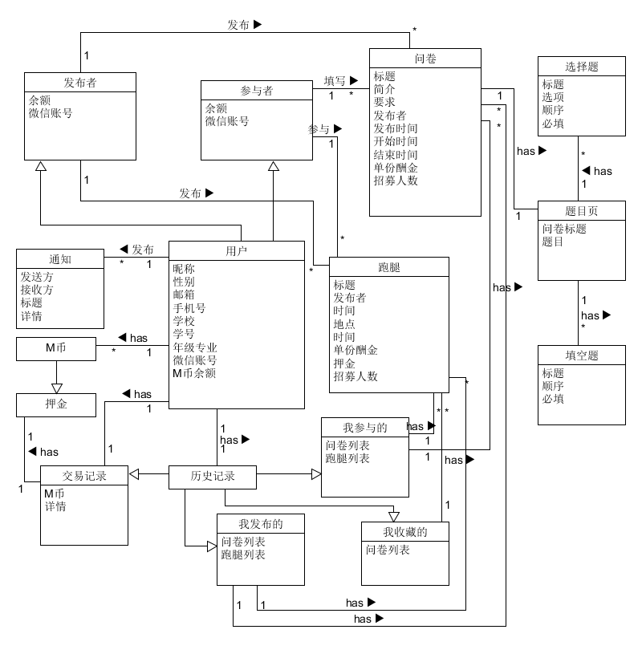

<h3 id="3.2">2. 子系统领域建模</h2>

#### 2.1 问卷系统领域模型

#### 2.2 跑腿系统领域模型

#### 2.3 个人系统领域模型

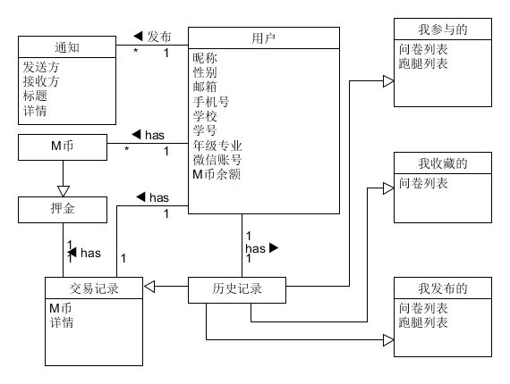

<h2 id="4">四、状态建模</h2>

<h3 id="4.1">1. 问卷对象状态建模</h3>

问卷包含发布中、发布失败、未开始、招募中、停止招募、已结束六个状态

<h3 id="4.2">2. 跑腿对象状态建模</h3>

跑腿包含发布中、发布失败、招募中、停止招募、已结束五个状态

<h2 id="5">五、功能建模</h2>

<h3 id="5.1">1. 问卷功能</h3>

#### 1.1 用户发布问卷

#### 1.2 用户填写问卷

#### 1.3 用户关闭问卷

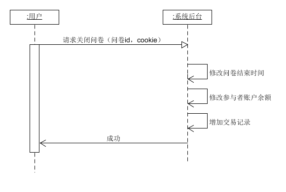

#### 1.4 用户删除问卷

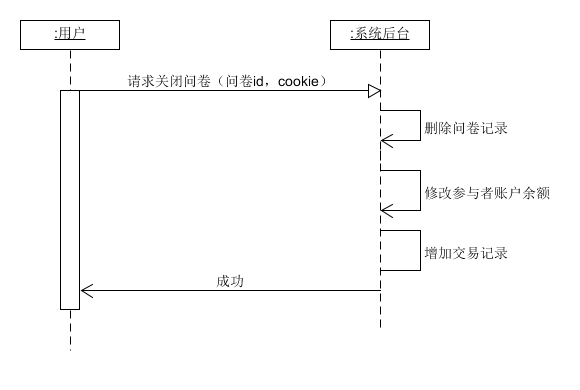

<h3 id="5.2">2. 跑腿功能</h3>

#### 2.1 用户发布跑腿

#### 2.2 用户参与跑腿

#### 2.3 用户关闭跑腿

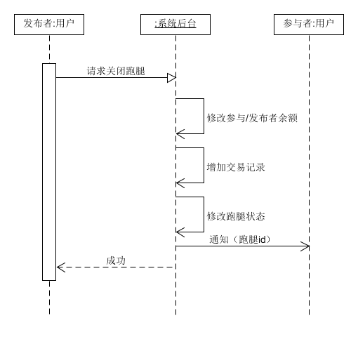

#### 2.4 用户删除跑腿

<h3 id="5.3">3. 账户管理</h3>

#### 3.1 充值

#### 3.2 提现

<h3 id="5.4">4. 通知相关</h3>

#### 4.1 接收通知

#### 4.2 删除通知

#### 4.3 发送通知

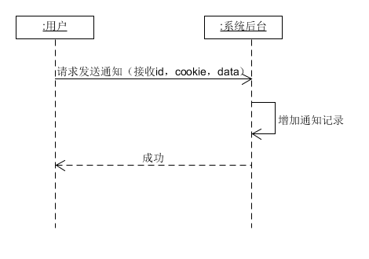

#### 4.4 标为已读/未读

<h3 id="5.5">5. 个人中心</h3>

#### 5.1 用户登录

#### 5.2 用户注册

#### 5.3 修改信息

<h2 id="6">六、补充需求</h2>

### 1. 简介

本文档列出了不便于在用例模型的用例中获取的系统需求。

### 2. 功能性

1. 容错处理：

   （1）当检测到任何api异步调用失败时均显式提示用户

   （2）出错时保证用户可以恢复上次编辑数据

2. 首页设置广告位，投放商家合作信息

   （1）大型活动通知（利于产品发展迭代）  

   （2）大中型任务快捷通道

3. 用户可在首页获取更多功能

   （1）获取酬金前十的任务

   （2）广告位投放资格（待设计）

### 3. 用户体验

#### 3.1 交互设计原则

1. 减少用户学习成本，使用明显的链接提示操作接口，为用户提供正在使用的交互流程中的所有内容和工具
2. 减少用户操作成本，使用更少的操作完成更多的功能
3. 保证用户具有一定程度的自由管理权利
4. 确保状态信息无误
5. 保证提示语等系统文字具有相同的风格
6. 系统错误提示统一在页面上方正中央使用Message组件提示
7. 谨记尼尔森十大交互设计原则

#### 3.2 UI排版原则

1. 亲密性：信息联系紧密的，间距相近，不同性质间距要远。
2. 节奏型：在同一个页面内容中，间距的样式不要太多，另外间距尽量使用倍数，比如1X，2X，3X，4X。信息较为紧密的，使用8的倍数，如8,16,24,32等，根据实际情况跟业务属性而定。
3. 黄金比例：大小设计多使用黄金比例保持美感
4. 统一使用线性图标，保证设计元素一致性
5. 六三一原则：主色调占60%，辅助色占30，突出色占10%。
6. 保证设计可迭代

### 4. 兼容性

1. 系统多平台兼容：商家端的操作界面以Web界面为主，只需要一个现代化浏览器即可使用，兼容Windows、macOS、Linux等多个系统平台。自适应的布局设计支持多种尺寸的屏幕显示。
2. 兼容不同分辨率大小的设备使用浏览器进行访问

### 5. 可靠性

1. 可恢复性：当单次请求调用出现错误时，使用合适的本地方案加以解决（如设置二次请求间隔时间，保证使用连贯性）
2. 数据冗余：周期性备份数据库数据，防止意外或人为操作导致数据丢失
3. 缓存查验：周期性查验缓存与数据库一致性

### 6. 安全性

1. 用户发送请求时后端使用cookie进行身份验证，确保用户只能访问到自己相关的数据
2. 保留完整的交易记录，以便于用户查验，并记录钱财流向
3. 数据库的备份使用密码加密存储，只有拥有密码的管理员可以解密读取备份的数据

### 7. 开源与免费工具

本系统开发与部署所使用的模块与软件均开放源代码，其开源协议支持商业非开源使用，以减少版权争议等法律相关的风险。同时承诺所有UI素材为原创设计，引用将附水印或在合作声明中引出。

使用工具与框架如下：

1. Vue
2. iview
3. axios
4. sprintboot
5. mysql
6. ...

### 8. 法律问题

根据《中华人民共和国消费者权益保护法》：

**（1）消费者拥有“知悉真实情况权”。**

即消费者所享有的知悉其购买、使用的商品的过程中或者接受的服务的真实情况的权利。消费者有权知悉的情况具体包括商品的价格、产地、生产者、用途、性能、规格、等级、主要成份、生产日期、有效期限、检验合格证明、使用方法说明书、售后服务，或者服务的内容、规格、费用等等。

因此，作为任务的发布者，用户对其自己声明的“商品”即任务的真实性负责，如有隐藏，本平台有权利根据网络安全协依法追责。

**（2）消费者拥有“自主选择权”。**

即消费者自主选择商品或者服务的权利。包括两方面：一是对商品的品种、服务方式及其提供者应有充分选择的余地;二是对于选择商品服务及其提供者应有自由决定的权利而不受强制。实际生活中，损害消费者自由选择权的现象主要是“官商”习气、商品搭售和强买强卖等。

消费者在本平台交易自由，完全实现了自主选择，同时，本平台设计了完善的押金制度，不会给投机者可乘之机。

**（3）消费者拥有“依法求偿权”。**

求偿权是指在当权利、资源等因个人或集体而遭受侵害、损失的时候，所具有的要求赔偿的权利。当消费者财产损害时有要求经营者依法予以赔偿的权利。消费者行使求偿权的方法，可以是向责任者直接提出损失赔偿请求，也可以是向管理机关、仲裁机关、司法机关提出损失赔偿请求。

因此，我们的平台要保留完整的交易记录作为证据，不允许任何人以任何借口进行修改，保证财产转移的透明性与可查性，以确保可参考性。

**（4）消费者拥有“受尊重权”。**

消费者在购买、使用商品和接受服务时，享有其人格尊严、民族风俗习惯得到尊重的权利。

所以，不允许用户发送存在歧视破坏民族团结等的字眼，同时本平台承诺管理员24小时在线接受用户的投诉并周期性进行查验。